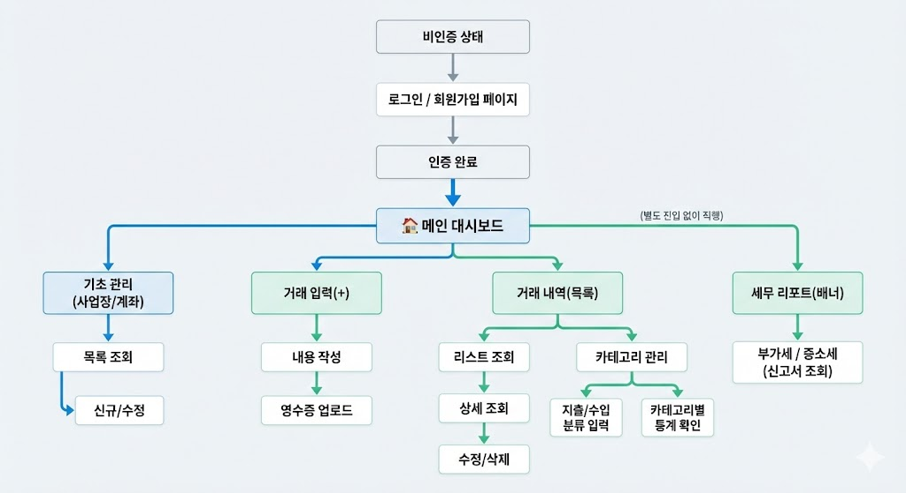
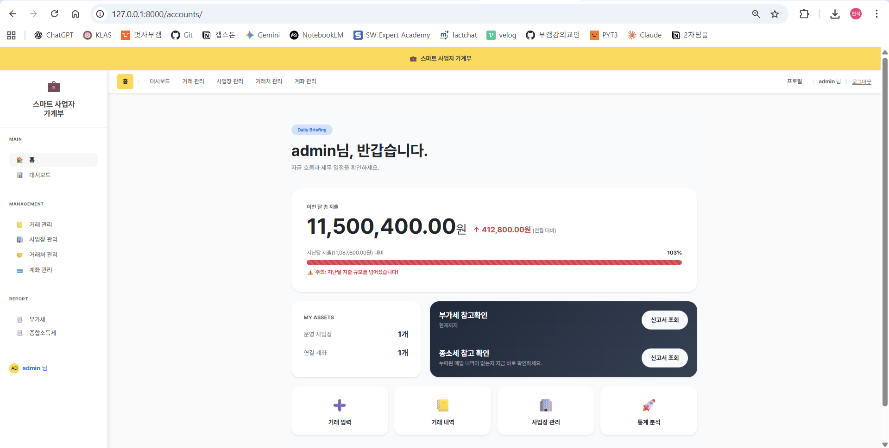

# 🧾 Smart Business Ledger (스마트 사업자 가계부)

서버 렌더링 기반 Django 웹 애플리케이션으로,  
소규모 사업자 및 무인매장 운영자를 위한 거래 내역 관리 및 세무 보고서 서비스입니다.

🌍 **배포 주소**: https://project2-f99c.onrender.com

---

## 🚀 주요 기능

- 사용자 인증 (회원가입 / 로그인 / 로그아웃 / 프로필 관리)
- 사업장 / 계좌 / 카테고리 CRUD
- 거래 내역 CRUD (수입 / 지출 / 부가세 자동계산)
- 거래 필터 / 검색 / 엑셀 업로드 / 다운로드
- 영수증 파일 업로드 (거래당 1개, 5MB 제한)
- 세무 보고서 (부가세 / 종합소득세 예상 세액 / 단순경비율 비교)
- 월별 대시보드 통계 (사업체별 수입 / 지출 / 순이익)
- 관리자 페이지 (superuser 전용)

---

## 🛠 기술 스택

| 구분 | 사용 기술 |
|------|---------|
| Backend | Django |
| Database | PostgreSQL (운영) / SQLite (개발) |
| Frontend | Django Template (Server Rendering) |
| 테스트 | pytest, pytest-django |
| CI/CD | GitHub Actions |
| Deployment | Render |

---

## ⚙ 로컬 실행 방법

```bash
# 1. 가상환경 활성화
source venv/bin/activate

# 2. 패키지 설치
pip install -r requirements.txt

# 3. 환경 변수 설정
touch .env

# 4. 마이그레이션
python manage.py migrate

# 5. 서버 실행
python manage.py runserver
```

---

## 🔐 환경 변수 (.env)

```env
DJANGO_SECRET_KEY=your_secret_key
DEBUG=1
POSTGRES_DB=your_db_name
POSTGRES_USER=your_db_user
POSTGRES_PASSWORD=your_db_password
POSTGRES_HOST=localhost
POSTGRES_PORT=5432
```

> `.env` 파일은 Git에 포함되지 않으며 `.gitignore`로 관리합니다.

---

## 📂 디렉토리 구조

```
project2/
├── apps/
│   ├── accounts/       # 인증 / 프로필 / 대시보드
│   ├── businesses/     # 사업장 / 계좌 관리
│   ├── core/           # 공통 모델 / 유틸리티
│   ├── dashboard/      # 대시보드
│   ├── tax/            # 세무 보고서 / 소득세 계산
│   └── transactions/   # 거래 / 영수증 / 카테고리
├── config/
│   └── settings.py
├── static/
├── templates/
├── manage.py
├── requirements.txt
└── README.md
```

---

## 화면 흐름 예시

<p align="center">
  
</p>

## 🖼 화면 예시



---

## ✅ 테스트 실행

```bash
pytest
```

CI는 `main`, `develop` 브랜치 push / PR 시 GitHub Actions에서 자동 실행됩니다.

---

## 📌 프로젝트 성격

본 프로젝트는 학습 및 포트폴리오 목적의 MVP 구현 버전입니다.  
운영 환경 수준의 확장 기능 및 고급 보안 기능은 포함하지 않습니다.

---

## 📄 라이선스

본 프로젝트는 개인 학습 및 포트폴리오 용도로 제작되었습니다.
